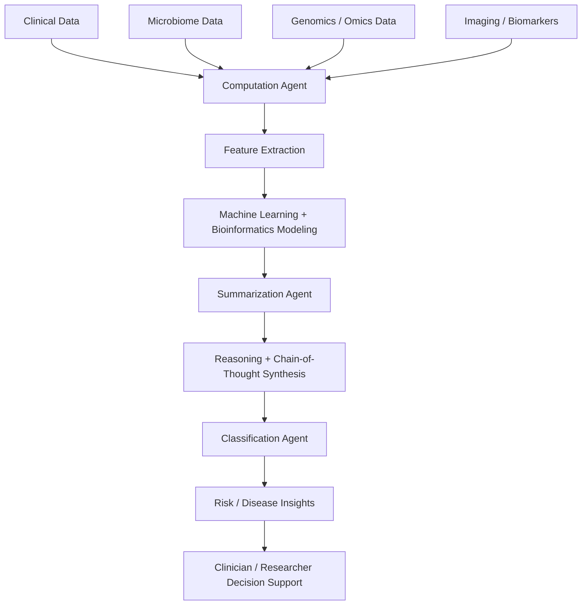
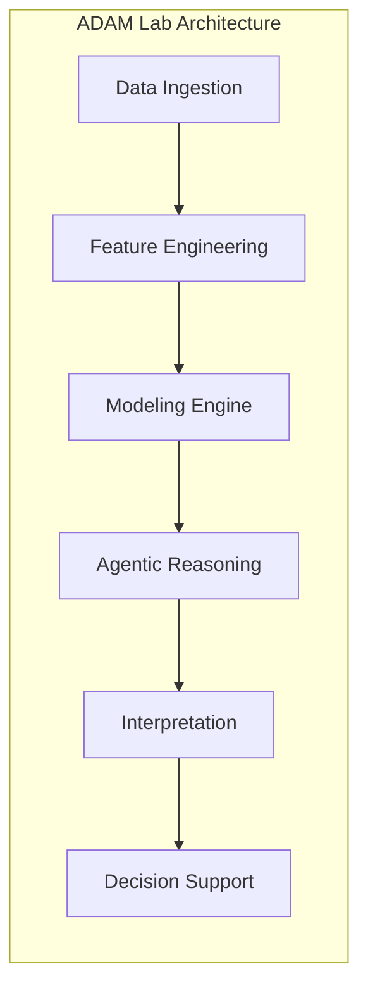
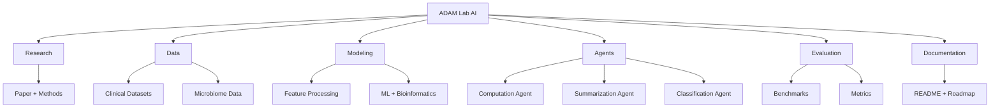
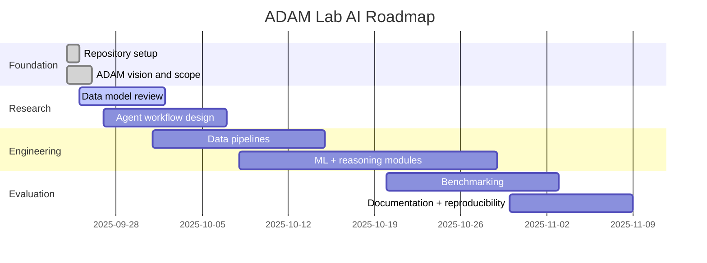

# ADAM Lab AI

ADAM Lab AI is a GitHub-first research and engineering lab for the ADAM project: a multi-agent AI framework for Alzheimer's disease analysis, biomedical insight generation, and microbiome-clinical data integration.

This repository is the umbrella project for the ADAM ecosystem and is inspired by the original ADAM work from the public repository `melhzy/ADAM` and the associated research publication referenced in PMC/NCBI and the IEEE Access paper.

## Mission

ADAM exists to turn complex biomedical data into interpretable, actionable intelligence through:

- multimodal biomedical data integration
- agentic AI reasoning
- retrieval-augmented generation (RAG)
- explainable clinical and computational workflows
- transparent, open, reproducible research tooling

## Research Origin

The ADAM project was developed as a reasoning and bioinformatics model for Alzheimer's disease detection and microbiome-clinical data integration.

Core references:

- Original project repo: https://github.com/melhzy/ADAM
- PMCID article: https://pmc.ncbi.nlm.nih.gov/articles/PMC12483529/
- IEEE Access paper: https://doi.org/10.1109/ACCESS.2025.3599857

## ADAM System Overview



## Core ADAM Architecture

The original ADAM design organizes the workflow around three functional AI agents:

1. Computation Agent
   - processes large and heterogeneous biomedical inputs
   - performs feature engineering and analytical modeling
   - identifies patterns across microbiome, clinical, and omics data

2. Summarization Agent
   - interprets model outputs and intermediate findings
   - converts computations into coherent summaries
   - supports reasoning and evidence-based narrative synthesis

3. Classification Agent
   - applies decision logic to summarize outputs
   - produces disease-relevant classifications and risk insights
   - supports interpretable downstream clinical reasoning



## ADAM Lab AI Scope

This repository acts as the home for the broader ADAM ecosystem, which may include:

- data pipelines for multimodal biomedical datasets
- reproducible experiments and benchmarking notebooks
- agent orchestration frameworks
- evaluation dashboards and reports
- research documentation and scientific communication
- future labs for translational AI, biomarker discovery, and clinical decision support

## Lab Structure



## Planned Repository Evolution

This repository is the foundation for a larger open lab. Future additions may include:

- `data/` for benchmark and sample datasets
- `notebooks/` for experiments and exploratory analysis
- `src/` for model and pipeline code
- `agents/` for agent implementations
- `eval/` for testing and metrics
- `docs/` for methods and architecture notes
- `papers/` for references and citations

## Roadmap



## Why ADAM Matters

ADAM represents a meaningful step toward biomedical AI systems that are:

- interpretable rather than opaque
- multi-agent rather than single-model-only
- cross-disciplinary across data science, clinical reasoning, and computational biology
- designed for scientific usefulness, not just prediction alone

## Citation

If you use ADAM concepts in your work, please cite the original publication.

```bibtex
@article{huang2025adam1,
  title     = {ADAM-1: An AI reasoning and bioinformatics model for Alzheimer’s disease detection and microbiome-clinical data integration},
  author    = {Huang, Ziyuan and Sekhon, Vishaldeep Kaur and Sadeghian, Roozbeh and Vaida, Maria L. and Jo, Cynthia and McCormick, Beth A. and Ward, Doyle V. and Bucci, Vanni and Haran, John P.},
  journal   = {IEEE Access},
  volume    = {13},
  pages     = {145953--145967},
  year      = {2025},
  publisher = {IEEE},
  doi       = {10.1109/ACCESS.2025.3599857},
  url       = {https://doi.org/10.1109/ACCESS.2025.3599857}
}
```

## Community and Contribution

This repository is intended to grow as a collaborative platform for research, engineering, and scientific communication around ADAM.

Contributions are welcome in areas such as:

- biomedical data processing
- model evaluation
- agent design
- documentation and interpretation
- reproducible benchmark pipelines

## Current Status

This is the initial ADAM Lab AI repository and acts as the foundation for an open, extensible, full GitHub-based AI lab focused on ADAM research and applications.

---

ADAM Lab AI is designed to make the ADAM project accessible, explainable, and extensible as a collaborative scientific platform.
